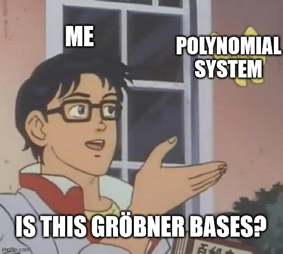

# Surface

| Category | Author   | Solves | Points |
| -------- | -------- | ------ | ------ |
| Crypto   | \\J      |    10  |   477  |

## Understanding the challenge

We are given two files, `surface.py` and `output.txt`.
Here is the relevant part:
```py
def encrypt(n):
	IV = os.urandom(16)
	FLAG = open("flag.txt", "rb").read()

	k = int.to_bytes(n, 32, "big")
	aes = AES.new(k, AES.MODE_CBC, iv = IV)
	ctxt = aes.encrypt(pad(FLAG, 16))
	output = {
		"iv": IV.hex(),
		"ciphertext": ctxt.hex(),
	}
	return output

if __name__ == "__main__":
	try:
		a = Fraction(input(">>> a = "))
		b = Fraction(input(">>> b = "))
		
		c = a**2 + b**2
		assert gmpy2.is_square(c.numerator)
		assert gmpy2.is_square(c.denominator)
		assert a * b == 20478 # 2*3*3413

		n = int(gmpy2.isqrt(c.numerator))

		output = encrypt(n)
		print(json.dumps(output))

	except:
		print("Error: check your inputs.")
```
We have to find two rationals `a` and `b` such that:
 - `a² + b²` is square
 - `ab = 20478 =: N`

The first thing one can think of are pythagorean triples. There are known rational parameterization for those, and we could check whether a given triple gives `ab = N`.
However, it soon becomes clear this is not the way (it would be too easy!): there are too many parameters to bruteforce on, and there's no guarrantee the solution triple is anywhere close to 0.
Substituting `b = N/a` in the parameterizations also doesn't help, it gives some very ugly expressions.


No, we have to go back to the basics. To solve this chall, I applied a somewhat general method:
 - Substitute everything into one or two equations so that you have the least amount of variables possible
 - Don't hesitate to add variables in the following two cases:
    1. Looking at discriminants of polynomials
    1. Creating substitution in order to reduce the degree
 - Whenever you get too complicated equations, compute their Gröbner basis
 - If you get simple enough equations, try to parameterize them

This is only a loose guideline and it's fine not to follow it in many cases.
It led me to a lot of dead ends before giving a solution (delving too deep into the discriminants rabbitholes, not noticing possible parameterizations soon enough leading to complicated expressions which were difficult to apply initial conditions on, etc...), so I'll present here only the path that worked.

We basically want to simplify the equations we have enough so that we can find a rational parameterization of `x²` and `y²`, then restrict the parameter so that our expressions for the squares are actually rational squares.

First things first, let us rewrite the problem as a system of polynomials:
 - `x² + y² - z² = 0`
 - `xy - N = 0`

We are looking for generators of the [zero-locus](https://en.wikipedia.org/wiki/Algebraic_variety) of these polynomials.
It's expected we will run into some kind of algebraic curve at some point, hence the name of the challenge.

The obvious first manipulation is substituting `y = N/x` into the first equation, yielding `x⁴ - z²x² + N² = 0`.
This can be seen as a degree 2 polynomial in `x²`, so we define its determinant `D² = z⁴ - 4N²`.
Notice how we expressed it as a squared number: we absolutely want the square root of the discriminant to be rational if `x` is to be rational.

Now the fourth power of `z` is frustrating; we can get rid of it by substituting `D = d + z²`. The equation becomes `2dz² + d² + 4N² = 0`.

This is becoming a mess already! Let us Gröbner it to hell and back.
```py
Q.<x, y, z, d, D> = PolynomialRing(QQ, order='lex')
I = Ideal([
    x^2 + y^2 - z^2,       # base equation
    x*y - N,               # base equation

    z^4 - 4*N^2 - D^2,     # definition of D
    d + z^2 - D,           # definition of d
    2*d*z^2 + d^2 + 4*N^2, # substitution

    # Factorization of a polynomial into its roots.
    (2*x^2 - z^2 - D)*(2*x^2 - z^2 + D),
])

list(I.groebner_basis())
```
```py
[x + 1/20478*y^3 + 1/20478*y*d - 1/20478*y*D,
 y^4 + y^2*d - y^2*D + 419348484,
 z^2 + d - D,
 d^2 - 2*d*D - 1677393936]
```

An interesting polynomial comes out: `d² - 2dD - 4N²`. It has low degree, and doesn't involve many variables.
Because it is so simple, we can try and parameterize it:
```py
A.<d, D> = QQ[]
C = Curve(d^2 - 2*d*D - 4*N^2)
C.rational_parameterization() # This is such a cheat
# I discovered it after going way too far into one of the dead ends and being forced to read sage's documentation for curves
```
```yml
Scheme morphism:
  From: Affine Space of dimension 1 over Rational Field
  To:   Affine Plane Curve over Rational Field defined by d^2 - 2*d*D - 1677393936
  Defn: Defined on coordinates by sending (t) to
        (3354787872/(-2*t), (-t^2 + 1677393936)/(-2*t))
```
It's a hit!


Let's add this to our list of conditions and see what comes out.
```py
Q.<x, y, z, D, d, t> = PolynomialRing(QQ, order='lex')
I = Ideal([
    x^2 + y^2 - z^2,
    x*y - N,

    z^4 - 4*N^2 - D^2,
    d + z^2 - D,
    2*d*z^2 + d^2 + 4*N^2,

    (2*x^2 - z^2 - D)*(2*x^2 - z^2 + D),
    
    (-2*t)*d - 8*N^2,
    (-2*t)*D - (-t^2 + 4*N^2),
    # We can't divide by t, else everything gets mapped into the fraction field [whose only non-zero ideal is (1)].
])
list(I.groebner_basis())
```
```py
[x + 1/20478*y^3 + 1/40956*y*d - 1/40956*y*t,
 y^4 + 1/2*y^2*d - 1/2*y^2*t + 419348484,
 z^2 + 1/2*d - 1/2*t,
 D - 1/2*d - 1/2*t,
 d*t + 1677393936]
```
Nothing really new... However, since we know a formula for `d` and `D` in terms of `t`, we can now factorize the polynomial in `y`.

```py
Q.<t> = FunctionField(QQ)
Q.<y> = Q[]
d = -4*N^2/t
factor(y^4 + 1/2*y^2*d - 1/2*y^2*t + N^2)
```
```py
(y^2 - 838696968/t) * (y^2 - 1/2*t)
```

This multiplication basically amounts to a logical or: either `y² = 2N²/t` or `y² = t/2`.
The next step would be to explore both possibilities and see which yields the solution.
But since the original problem is symmetric in `x` and `y`, choosing either one of the values will probably change nothing.

Add one of them to our constraints, and Gröbner everything once again!
```py
Q.<x, y, z, D, d, t> = PolynomialRing(QQ, order='lex')
I = Ideal([
    x^2 + y^2 - z^2,
    x*y - N,

    z^4 - 4*N^2 - D^2,
    d + z^2 - D,
    2*d*z^2 + d^2 + 4*N^2,

    (2*x^2 - z^2 - D)*(2*x^2 - z^2 + D),
    
    (-2*t)*d - 8*N^2,
    (-2*t)*D - (-t^2 + 4*N^2),
    
    y^2 - t/2,
])
list(I.groebner_basis())
```
```py
[x + 1/40956*y*d,
 y^2 - 1/2*t,
 z^2 + 1/2*d - 1/2*t,
 D - 1/2*d - 1/2*t,
 d*t + 1677393936]
```



Things simplify really well! We can express `x²`, `y²`, and `z²` as functions of `t`.

```py
Q.<t> = FunctionField(QQ)
d = -4*N^2/t
z2 = t/2 - d/2
y2 = t/2
x2 = y2*d^2/(4*N^2)

print('x2 =', x2)
print('y2 =', y2)
print('z2 =', z2)
```
```py
x2 = 838696968/t
y2 = 1/2*t
z2 = (1/2*t^2 + 838696968)/t
```

Rewritten in term of `N`:
 - `x² = 2N²/t` (that was the other value for `y²` above)
 - `y² = t/2`
 - `z² = (t²/2 + 2N²)/t`

The first two conditions are simple enough. We want `2N²/t` and `t/2` to be square; it is equivalent to saying that `t = 2n²` for some *rational* `n`.

The equality for `z²` now says that we want `(4n⁴/2 + 2N²)/(2n²) = (n⁴ + N²)/n²` to be square. It is necessary and sufficient to find `m` such that `n⁴ + N² - m² = 0`.

Once again, we can change variables to get rid of the fourth power of `n`: let `m = k + n²`.
The equation becomes `2kn² + k² - N² = 0`, which we can see as a degree 2 polynomial in `n`.

Its discriminant is `δ² = -8k³ + 8N²k`. Now there is something truly interesting: this is nearly the weierstrass form of an elliptic curve!
Our last change of variables will be `K = -2k`, to rewrite `δ² = K³ - 4N²K`.

Finding a generator of this elliptic curve will give us `δ` and `K`, hence `k`, hence `m` and `n`, hence `t`, hence `x²`, `y²`, and `z²`. It will have been chosen so that the `x²`, `y²`, and `z²` we found are rational squares and verify `xy = N`.

In other words, we will at long last have finished.

Unfortunately, sage doesn't manage to find it. But when sage doesn't work, magma does!
```haskell
P<x>:=PolynomialRing(RationalField());
E:=EllipticCurve([-4*20478^2,0]);
print Generators(E);
```
```scala
[ (40956 : 0 : 1), (0 : 0 : 1), (2949375095449204352182037675175687476264304/10893159238600577313677917228652511841 : 5006896931555584379147668824236445709299600194647862057383800240/35952639365198540562613869494033558726733788804390127889 : 1) ]
true true
```

We can now decrypt :happy:

```py
K = 2949375095449204352182037675175687476264304/10893159238600577313677917228652511841
δ = 5006896931555584379147668824236445709299600194647862057383800240/35952639365198540562613869494033558726733788804390127889
assert δ^2 == K^3 - 4*N^2*K
k = -K/2                    # definition of K
n = δ/(4*k)                 # definition of δ
m = k + n^2                 # definition of k
assert n^4 + N^2 == m^2
t = 2*n^2                   # definition of n
x2 = 2*N^2/t                # parameterization by t
y2 = t/2                    # parameterization by t
z2 = t/2 + 2*N^2/t          # parameterization by t
assert x2 + y2 == z2
assert x2*y2 == N^2
z = sqrt(z2)
print(decrypt(int(z.numerator())))
```
```py
b'FCSC{67084c2bc8acfbf5e8a0d5e2809e230d092ab56630713dbe33ca42b8430a992b}\n\t\t\t\t\t\t\t\t\t'
```


