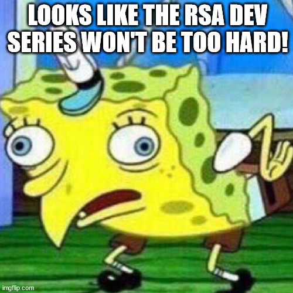
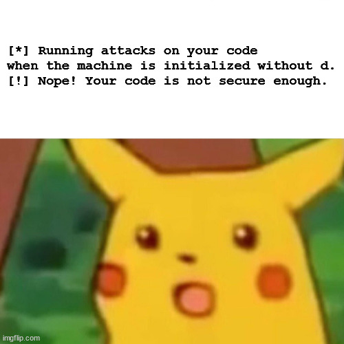
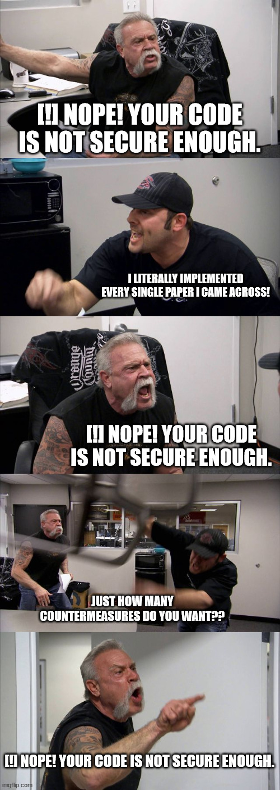
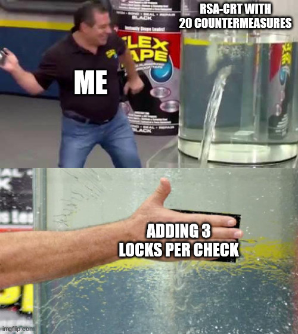
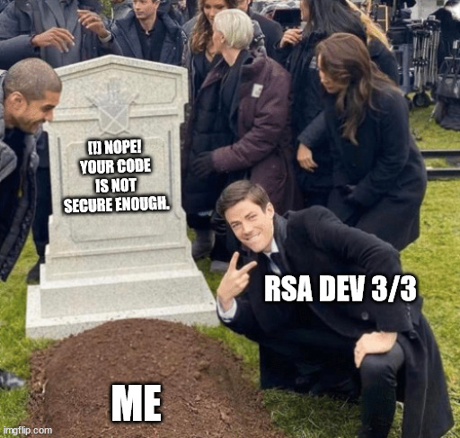
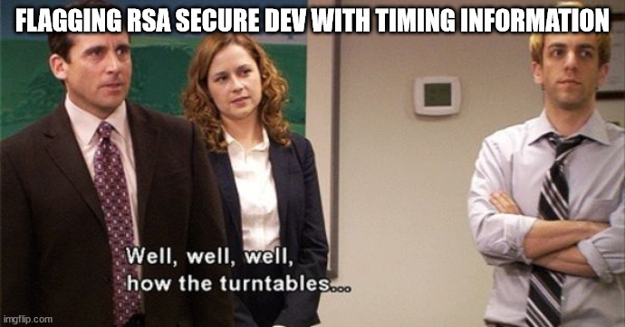

# RSA Secure Dev

**Challenge files:**
- `machine.py`
- `assembly.py`
- `challenge.py`
- `rsa_keygeneration.py`

**Remote:** `nc challenges.france-cybersecurity-challenge.fr 2352`

The files are common to all three parts of the challenge.
`machine.py` implements a vm, `assembly.py` is a compiler, `challenge.py` contains the functions pertaining to the three parts of the chall, and `rsa_keygeneration.py` is an utility for, obviously, generating RSA keys.

## Part 1

Category | Author | Solves | Points
-------- | ------ | -----: | -----:
Side Channels and Fault Attacks   | Neige  | 54     | 372

> Lors de l'entretien d'embauche, la société Obiture teste votre capacité à produire un code assembleur pour calculer une signature RSA.

The description is quite self-explanatory: we must implement, using the assembly language of the vm, an RSA signature.
We don't need to reverse the vm, as we are given general informations about it [here](https://www.france-cybersecurity-challenge.fr/vm).

The relevant code in `challenge.py` checks that our code is correct and achieve reasonable performances compared to the reference solution:
```py
def easy(code):
    correctness(code)
    performances(code)
    flag_easy = open("flag_easy.txt").read().strip()
    print(f"[+] Congrats! Here is the easy flag: {flag_easy}")
```
where `correctness` tests our code against one static and one randomly generated key, and `performance` benchmarks both our code and the reference.
We must achieve no more than a `5/3` ratio between their running times.

Since they want performance, and the machine is given `dp` and `dq`, let's implement a naive RSA-CRT.
The algorithm basically works like so:
```haskell
Inputs: m, dp, dq, p, q, iq
Output: m^d mod pq

sp = m^dp mod p
sq = m^dq mod q
s  = CRT(sp, sq)  -- usually, (sp - sq mod p)*q*iq + sq mod pq
RETURN s
```

The cost of performing more operations is overshadowed by that 

```haskell
; R2 = Sq
MOV RD, R7 ; RD = q
MOV RC, RA ; RC = dq
POW R2, R5 ; m^dq % q

; R1 = Sp
MOV RD, R6 ; RD = p
MOV RC, R9 ; RC = dp
POW R1, R5 ; m^dp % p

; R1 = (Sp - Sq)Iq mod p
MOV R4, R8     ; R4 = Iq
SUB R1, R1, R2 ; Sp - Sq
MUL R1, R1, R4 ; * Iq
MOD R1, R1     ; % p

; R1 = R1*q + Sq mod N
MUL R4, R6, R7 ; R4 = N
MOV RD, R4     ; RD = N
MUL R1, R1, R7 ; * q
ADD R1, R1, R2 ; + Sq
MOD R0, R1     ; % N
STP
```

```yml
Enter your bytecode in hexadecimal:
>>> 007D00AC0352006D009C035100844c894f0902114ff4004D4fc94a8902101400
Which flag do you want to grab?
  0. Quit.
  1. Easy flag   - check for code correctness and performances.
  2. Medium flag - check resistance against several fault attacks, d not given.
  3. Hard flag   - check resistance against more fault attacks, not e and not d given.
>>> 1
[+] Testing correctness...
[+] Correct!
[+] Testing performances against the reference solution...
[*] Reference performances: 9002908.03 ns
[*] User performance:       6983576.58 ns
[*] Ratio:                     0.78
[+] Congrats! Here is the easy flag: FCSC{06de1084d295f2a016f79485f2a47744bfb9ed3e30e9312121665559df9447de}
```




## Part 2

Category | Author | Solves | Points
-------- | ------ | -----: | -----:
Side Channels and Fault Attacks   | Neige  | 13     | 469

> Vous voilà embauché chez Obiture et on vous demande maintenant de calculer une signature RSA avec un code résistant à une attaque par faute tout en gardant de bonnes performances. Vous devez résister à la fameuse attaque de Bellcore.

Things get slightly more complicated: now, our RSA signature must be resistant to some fault attacks.
Of course the naive implementation above doesn't suffice.
```yml
>>> 2
[*] Running attacks on your code when the machine is initialized without d.
[!] Nope! Your code is not secure enough.
```

What makes this chall harder is that we don't know what happens in `medium_attack`.
```py
def medium(code):
    print("[*] Running attacks on your code when the machine is initialized without d.")
    check, t = medium_attack(code)
    if not check:
        print("[!] Nope! Your code is not secure enough.")
        return

    flag_medium = open("flag_medium.txt").read().strip()
    print(f"[+] Congrats! Here is the medium flag: {flag_medium}")
```
The threat model is also not clarified, which can make the chall feel quite guessy.
However, this is more realistic: in real life, you can't know exactly what your attacker is going to do.
We are also given a lead, the Bellcore attack.
Searching about it on the internet quickly yields plenty of information; this attack is in fact very simple in principle.

Imagine you want to recover the secret key of some hardware implementing RSA-CRT.
Choose a message `m`, and compute a valid signature `s`.
Now sign `m` but introduce a fault in the computation of, say, `sp`.
The quantity `s - s'` has non-trivial gcd with `n`!
In fact, `s - s' mod p = sp - s'p mod p ≠ 0` whereas `s - s' mod q = sq - sq mod q = 0`, which implies that `gcd(s - s', n) = q`.

What's more, there are plenty of ways to inject such a fault: corrupt `dp` in memory, skip an instruction within the exponentiation, corrupt the result of the exponentiation, corrupt the message to be signed, and much more.

Luckily, there is an easy countermeasure: simply compute `s^e mod n` and check that it is equal to `e`.
If they are different, erase everything.
Otherwise, output the result.
This should be pretty safe, right?



It turns out the attacker also has plenty of ways to circumvent the countermeasure!
For instance, she could corrupt the `Z` register so that jumps are (not) taken.
Luckily, the literature describes a way to circumvent the circumventing; this is called the *lock principle*.

The idea is pretty simple (but inventing it is not so simple!):
```haskell
Inputs: res, guard, guard'
Output: res if guard == gard', erase everything otherwise

IF guard != guard' THEN ERASE
out = res
IF guard != guard' THEN ERASE
RETURN out
```
Implementing a lock makes the procedure resistant against *second-order fault attacks*, an adversary faulting the code twice in an attempt to skip the checks.
I guess increasing the amount of statements would increase the order of faults we are resisting against (?), but for this chall this is sufficient:
```haskell
; R2 = Sq
MOV RD, R7 ; RD = q
MOV RC, RA ; RC = dq
POW R2, R5 ; m^dq % q

; R1 = Sp
MOV RD, R6 ; RD = p
MOV RC, R9 ; RC = dp
POW R1, R5 ; m^dp % p

; R1 = (Sp - Sq)Iq mod p
MOV R4, R8     ; R4 = Iq
SUB R1, R1, R2 ; Sp - Sq
MUL R1, R1, R4 ; * Iq
MOD R1, R1     ; % p

; R1 = R1*q + Sq mod N
MUL R4, R6, R7 ; R4 = N
MOV RD, R4     ; RD = N
MUL R1, R1, R7 ; * q
ADD R1, R1, R2 ; + Sq
MOD R1, R1     ; % N

; Check signature correctness
MOV RC, RB ; RC = e
POW R2, R1 ; R2 = s^e % N

; Lock principle
CMP R2, R5 ; R2 ? m
JNZA erase
MOV R0, R1 ; R0 = s
CMP R2, R5 ; R2 ? m
JZA end

erase:
MOV R0, RF
MOV R1, RF
MOV R2, RF
MOV R3, RF
MOV R4, RF
MOV R5, RF
MOV R6, RF
MOV R7, RF
MOV R8, RF
MOV R9, RF
MOV RA, RF
MOV RB, RF
MOV RC, RF
MOV RD, RF

end:
STP
```
Note how the signature never goes into `R0` before the lock.
If we simply had two checks, the attacker might be able to simply stop the machine before the erasure and recover the output: this countermeasure would have amounted to nothing!
We prevent such a scenario by writing the temporary results in `R1`, which according to the challenge description isn't accessible to the attacker as machine output.

```yml
Enter your bytecode in hexadecimal:
>>> 007D00AC0352006D009C035100844c894f0902114ff4004D4fc94a89021100BC031206528A000018001006528800002600F000F100F200F300F400F500F600F700F800F900FA00FB00FC00FD1400
Which flag do you want to grab?
  0. Quit.
  1. Easy flag   - check for code correctness and performances.
  2. Medium flag - check resistance against several fault attacks, d not given.
  3. Hard flag   - check resistance against more fault attacks, not e and not d given.
>>> 2
[*] Running attacks on your code when the machine is initialized without d.
[+] Congrats! Here is the medium flag: FCSC{3704721831edcd9f4cd231eb45a4880ea7af6962c358af355130d6881c155479}
```


## Part 3

Category | Author | Solves | Points
-------- | ------ | -----: | -----:
Side Channels and Fault Attacks   | Neige  | 2     | 498

> En tant qu'expert chez Obiture, vous devriez être capable de produire un code pour calculer une signature RSA qui résiste à plusieurs attaques par faute alors même que vous ne connaissez pas la clef publique.

Things get harder yet again.
This time we aren't even given `e`, so we can't check `m` against `s^e mod pq`!

Nevertheless, the literature does describe this situation, along with two families of countermeasures dedicated to this case:
- checking procedures
- infective procedures

Countermeasures belonging to the first family verify that some arithmetical identities hold and obliterate the result otherwise, whereas infective procedures attempt to propagate the error.
That is, the idea is to make the computation as complicated as possible while retaining decent performances, so that if a fault is introduced at some point it corrupts the final result so completely that it becomes impossible to extract any kind of meaningful information.

This sounds very promising, so let's try exactly that.



At some point the bytecode grows so convoluted that I have to throw it away because I can't even debug the correctness anymore.



At this point I realize a dreadful truth: every countermeasure I tried has a fatal weakness.
Indeed, if `dp` (or `dq`) got corrupted since the beginning, they wouldn't be able to distinguish between an actually correct key because we don't know `d` nor `e`.
Even worse, the correctness forces the code to compute a "valid" signature in that case, making it vulnerable once again to the Bellcore attack.
Is the chall even solvable?
This is the moment I give up.

However! Only a day later, Achléole flags!
This means the chall is possible after all 👀.
With a sudden burst of motivation, I go back to working on it.
Let's make the assumption that there are no permanent faults on `dp` and `dq`.



I'm just about to give up again when I get an idea that sounds somewhat hairbrained, but interesting enough to give it a try: what if we could do just like part 2?
We have enough information to recompute `e`, and then we could check `m` against `s^e mod pq`.
And of course, a lock around that.

I also implement something (computing `sp' = m^{dp - 1} mod p` and `sq' = m^{dq - 1} mod q` then checking `s'm` against `s`) inspired by Giraud's countermeasure because it doesn't add too much complexity to the code and two checks are better than one.

```haskell
MOV R0, #1

; inverse of (q-1)/g mod (p-1)
SUB R6, R6, R0 ; p-1
SUB R7, R7, R0 ; q-1
GCD R1, R6, R7 ; g
DIV R1, R7, R1 ; (q-1)/g
MOV RD, R6
INV R2, R1     ; iq

; d
MOV R3, R9
MOV R4, RA
SUB R3, R3, R4 ; dp - dq
MUL R3, R3, R1 ; *(q-1)/g
MUL R3, R3, R2 ; *iq
ADD R3, R3, R4 ; +dq

; e
MUL R1, R1, R6 ; λ(pq)
MOV RD, R1 
INV R3, R3     ; e
MOV RB, R3

; clean
ADD R6, R6, R0 ; p
ADD R7, R7, R0 ; q

; m^dq
MOV RD, R7
MOV RC, RA
POW R3, R5     ; R3 = m^dq % q

; m^{dq - 1}
MOV R4, RA
SUB R4, R4, R0
MOV RC, R4
POW R4, R5     ; R4 = m^{dq-1} % q

; m^dp
MOV RD, R6
MOV RC, R9
POW R1, R5     ; R1 = m^dp % p

; m^{dp - 1}
MOV R2, R9
SUB R2, R2, R0
MOV RC, R2
POW R2, R5     ; R2 = m^{dp-1} % p

; recombination
SUB R1, R1, R3
MOV R0, R8
MUL R1, R1, R0
MUL R1, R1, R7
ADD R1, R1, R3 ; s

; recombination
SUB R2, R2, R4
MUL R2, R2, R0
MUL R2, R2, R7
ADD R2, R2, R4 ; s'

; normalization
MUL R4, R6, R7
MOV RD, R4
MOD R1, R1

; recombination verification
MUL R3, R2, R5 ; s'm
MOD R3, R3
CMP R1, R3 ; lock principle
JNZA erase
MOV R4, R1
CMP R1, R3
JZA nextverif
JA erase

nextverif:
MOV RC, RB
POW R1, R4
MOD R1, R1
MOD R5, R5
CMP R1, R5 ; lock principle
JZA unlock
JA erase
unlock:
MOV R0, R3
CMP R1, R5
JNZA erase
STP

erase:
MOV R0, RF
MOV R1, RF
MOV R2, RF
MOV R3, RF
MOV R4, RF
MOV R5, RF
MOV R6, RF
MOV R7, RF
MOV R8, RF
MOV R9, RF
MOV RA, RF
MOV RB, RF
MOV RC, RF
MOV RD, RF
STP
```

Now let's submit that to the remote!


Very disappointing.
However, there is an interesting observation to be made: the rejection of the code took much longer than previous tries.
Could this mean it passes more checks?
Trying again, the time varies wildly.
Could this mean some of these faults are random?
Since I pass them with not insignificant probability, perhaps I could just submit the code several time and get lucky once.

And indeed, it eventually yields the flag!



In fact, it turned out afterwards (thanks Neige!) the "random component" was due to a bug on my part when computing `e`.