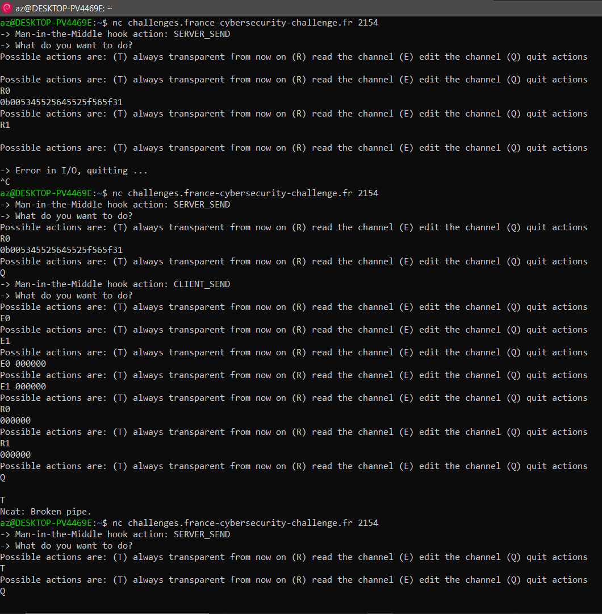

# Secret Shenaningans

Category | Author | Solves | Points
-------- | ------ | -----: | -----:
Crypto   | ???    | 10     | 477

> Un malfrat, versé dans la technique, se méfie des protocoles de canaux sécurisés éprouvés comme SSH ou TLS : *"ils sont tous certainement backdoorés"*, pense-t-il. Comme il doit régulièrement recevoir des informations confidentielles de collègues à lui, il a développé son propre protocole d'établissement de canal sécurisé permettant à des clients anonymes d'envoyer à son serveur ces informations confidentielles.
> 
> Vous avez accès à un TAP réseau vous positionnant en Man-in-the-Middle entre un client et le serveur, et vous avez par ailleurs réussi à dérober le code source de l'application (sans la clé privée du serveur malheureusement ...). Saurez-vous récupérer le secret que le client envoie au serveur ?

**Challenge files:**
- `README.md`
- `SRC_README.md`
- `Makefile`
- `Dockerfile`
- `docker-compose.yml`
- `src/common.py`
- `src/client.py`
- `src/server.py`
- `src/sniffer.py`
- `src/genserverkeys.py`
- `src/data/flag.txt`
- `src/data/server_private_key.der`
- `src/data/server_public_key.der`

## Approaching the challenge

Woah. Too many files.
When presented with a challenge that has so much to parse through, the first reflex is:
- take a look at the READMEs. Maybe read them.
- try to interact a little bit with the remote, see what it looks like.
- get a very high level idea of what the challenge does.
- identify the goal; ie. what problem we have to solve in order to retrieve the flag.
- actually start solving; fill in precise details on a need-to-know basis.

#### The READMEs.

`README.md`
> The TAP is set between a client and a server, and it "freezes" the two connection channels
(from server to client and from client to server) whenever one of the two parties sends a packet.
When in TAP mode, it is possible for the attacker to either:
> 
> - Read the two communication buffers using 'R0' (from server to client) or 'R1' (from client to server).
> The output is the hexadecimal value of the buffer.
> - Edit these two communication buffers using 'E0' and 'E1' with an hexadecimal value.
> - Activate the "always transparent mode from now on" to avoid TAP invocation further away, using 'T'.
> - Quit this TAP hook using 'Q', the TAP hook will be spawn again at the next server or client packet
> sending action (except if the "always transparent mode" has been set up earlier).
> 
> Beware that tampering with the communication channels can freeze the client and the server, or
> make them panic: use with care :-)

Huh. Interesting. So basically we can read and alter communications.
We may or may not be able to prevent messages from being sent, or send fake messages.

`SRC_README.md`
> The flag and the keys here are not the ones in production (only here for testing purpose).

Okay yeah obviously.

#### Remote interaction



Not very conclusive.
We only have access to the tap, no log or anything from the server or client.
If we wait too long it errors out.
Blindly editing data makes the remote die.

#### Very high level idea

This is where we get into the meat of the matter.
- `sniffer.py`: seems like it does exactly as advertised. It starts threads that run the client and server and handles all communication between them.
We can actually make it seem as if a message wasn't sent by editing it as empty bytes.
Does threads something or something. We don't care about the implementation details (perhaps later).
- `common.py`: general utilities and backend cryptography. We'll very probably cut it open later, but it's not important right now.
- `server.py`: does a lot.
   1. load public/private key
   1. send server version
   1. get client version
   1. generate an ECDSA keypair (`y`, `Gy`)
   1. wait till client sends special packet (`KEXDH_INIT`)
   1. get the client public key (`Gx`) from the `KEXDH_INIT` packet
   1. derive shared secret
   1. send some signed message with some information (signed with the loaded private key) (`KEXDH_REPLY`)
   1. wait till client sends special packet (`NEWKEYS`)
   1. also send `NEWKEYS` (empty packet)
   1. from now on, only use encrypted packets
   1. send `SC_SERVER_ADDITIONAL_INFO`
   1. send `GET_FLAG`
   1. asserts client answers with `GET_FLAG`
   1. the end.
- `client.py`: does a lot too.
   1. load public key
   1. send client version
   1. get server version
   1. generate an ECDSA keypair (`x`, `Gx`)
   1. send `KEXDH_INIT` with `Gx`
   1. wait till server answers with `KEXDH_REPLY`
   1. get `Gy` from that
   1. verify the signature (using the loaded public key)
   1. send `NEWKEYS` (empty packet)
   1. wait till server answers with `NEWKEYS` (also empty packet)
   1. from now on, only use encrypted packets
   1. loop and do something different for different packet types
      - ...
      - `DISABLE_SC`: don't use encrypted packets anymore
      - `GET_FLAG`: send flag then break loop
      - `SC_SERVER_ADDITIONAL_INFO`: assert packets are encrypted
   1. the end.
- `genserverkeys.py`: generates the loaded public/private keys

#### The goal

We need to get the client to send the flag, and we need to understand the reply.
There are two obvious avenues for that:
- either mess with the shared secret and listen in the encrypted packets,
- or somehow disable packet encryption and just read the flag loud and clear


## The first avenue

In a man in the middle context, the first idea that comes to mind is to actually act as a middleman and make both server and client securely communicate, but with *you*.
That is, generate your own ephemeral key `(z, Gz)`; intercept `Gx` and send `Gz`; intercept `Gy` and send `Gz`; derive the shared secrets, encrypt, decrypt, everything is nice, and something so easy is too easy to be a 3 stars chall.
Still, it would be foolish not to try!

We are immediately hit with a dire problem.
Remember the signed message with some information in it?
Here's what it looks like server side:
```py
# Here, we compute the shared secret from CMD_KEXDH_INIT
Gx = payload
shared_secret = ECDH_gen_shared_secret(y, Gx)

# Sign the whole key exchange and send the CMD_KEXDH_REPLY
sig = sign_key_exchange(SERVER_VERSION_STRING + client_version + Gx + Gy + server_public_key_raw + shared_secret, server_private_key)
payload_to_send = Gy + sig
send_packet_counter = clear_send_packet(send, recv, CMD_KEXDH_REPLY, payload_to_send, send_packet_counter)
```
and client side:
```py
Gy, sig = payload[:-64], payload[-64:]

# Here, we compute the shared secret from CMD_KEXDH_REPLY
shared_secret = ECDH_gen_shared_secret(x, Gy)

# Check that the key exchange is indeed OK and that this is the server we are supposed to talk to
check = verify_key_exchange(server_version + CLIENT_VERSION_STRING + Gx + Gy + server_public_key_raw + shared_secret, server_public_key, sig)
if not check:
    logger.error("[CLIENT] Error: key exchange signature is not verified. Aborting.")
    thread_exit()
```
Everything is validated! Even the shared secret!
And of course we can't access, much less modify, the `server_public_key`.
Unless we manage to mess with the contents of the message in a very sophisticated way that lets the server sign whatever we want, we'll have to defeat the signature.
That sophistication looking either too sophisticated or an utter waste of time, we'll keep it as a last resort in the case everything else doesn't work.

Defeating the signature sounds like a tall order.
After all, it is done using primitives from a long-standing, well known python cryptography library.
```py
from Crypto.Hash import HMAC, SHA256
from Crypto.Signature import DSS

#### Key exchange for secure channel establishment primitives
def sign_key_exchange(data, private_key):
    h = SHA256.new(data)
    sig = DSS.new(private_key, encoding = 'binary', mode = 'fips-186-3').sign(h)
    return sig

def verify_key_exchange(data, public_key, sig):
    h = SHA256.new(data)
    try:
        DSS.new(public_key, encoding = 'binary', mode = 'fips-186-3').verify(h, sig)
        return True
    except:
        return False
```
Still, I wouldn't put it past Cryptanalyse to have found a 0-day and burn it in the FCSC.
There is also a somewhat well known cheese that happens semifrequently in ctf challs rolling their own [DSA](https://en.wikipedia.org/wiki/Digital_Signature_Algorithm) using pycryptodome's `inverse` function; it turns out that `inverse(0, q)` yields `0` instead of raising an error.
Should you then forget to check that `0 < s < q`, a player may use `s = 0, r = 1` as a valid signature no matter the message.
I cheesed challs in *three* different ctfs with that.


Of course, reading the source code reveals that pycryptodome people didn't make that silly mistake.
A man can dream.


## The second avenue

If 0-days lay there, well hidden they are.
Let's give up on the first avenue for now.
Having still not explored the second, it is time for us to sniff at it.
I seriously doubt a chall author would write such code for absolutely no reason, after all:
```py
elif cmd == CMD_DISABLE_SC:
    # This can only be excuted when the secure channel is set
    logger.warning("[CLIENT] CMD_DISABLE_SC received")
    if not secure_channel:
        logger.error("[CLIENT] Error: CMD_DISABLE_SC while secure is not active. Aborting.")
        thread_exit()
    # Disable the secure channel
    secure_channel = False
    continue
```
(edit: baiting players is in fact a perfectly valid reason)

The goal here is to make the server read a `DISABLE_SC` command from an encrypted packet.
We need to dig in `common.py` to understand exactly how packets are encrypted.

```py
#### Secure channel communication using Encrypt-then-MAC with established keys
def sc_send_packet(send, recv, cmd_type, payload, kenc, kmac, packet_counter, iv):

    # Get the padding to apply
    pad = AES.block_size - ((len(payload) + 2) % AES.block_size)
    payload = cmd_type + len(payload).to_bytes(1, byteorder = 'big') + payload + (pad * b'\x00')

    # Encrypt the padder payload
    cipher = AES.new(kenc, AES.MODE_CBC, iv=iv)
    payload = cipher.encrypt(payload)

    # Compute the HMAC on
    h = HMAC.new(kmac, digestmod = SHA256)
    if len(payload) + h.digest_size > 255:
        logger.error("[ERROR] Payload len is too big")
        thread_exit()

    prepend = (len(payload) + h.digest_size).to_bytes(1, byteorder = 'big')

    # Update with the implicit 64 bits packet counter
    h.update(packet_counter.to_bytes(8, byteorder = 'big'))

    # Update with the length
    h.update(prepend)
    h.update(payload)
    # Append the HMAC
    new_iv = payload[-AES.block_size:]
    payload = prepend + payload + h.digest()

    # Check the whole length
    if len(payload) > 255:
        logger.error(f"[ERROR] Payload len {len(payload)} is too big")
        thread_exit()

    send(payload)
    return packet_counter + 1, new_iv
```

oof.
So basically the message is encrypted (AES-CBC), then a hmac validates:
- the packet counter (ie. the amount of packets sent (resp. received) during the communication)
- the length of the packet
- the encrypted message

The hmac key and encryption key are derived from the shared secret with sha256, so we don't know them.

And here's how a packet is decrypted:
```py
def sc_recv_packet(send, recv, kenc, kmac, packet_counter, iv, expected_cmd = None):

    h = HMAC.new(kmac, digestmod = SHA256)

    # Receive the encrypted command length
    packet_len_byte = recv(1)
    packet_len = int.from_bytes(packet_len_byte, byteorder = 'big')

    # Receive the rest
    packet = recv(packet_len)

    # Packet should be at least MAC plus one block
    if len(packet) < (h.digest_size + AES.block_size):
        logger.error("[ERROR] Unexpected encrypted packet!")
        thread_exit()

    # Check the mac
    mac = packet[-h.digest_size:]
    enc_payload = packet[:-h.digest_size]
    new_iv = enc_payload[-AES.block_size:]

    # Update with length and packet counter
    h.update(packet_counter.to_bytes(8, byteorder = 'big'))
    h.update(packet_len_byte)
    h.update(enc_payload)
    hmac = h.digest()
    if hmac != mac:
        logger.error("[ERROR] Erroneous MAC in encrypted packet!")
        thread_exit()

    # MAC is OK, decrypt stuff
    cipher = AES.new(kenc, AES.MODE_CBC, iv = iv)
    payload = cipher.decrypt(enc_payload)
    if len(payload) < 2:
        logger.error("[ERROR] Erroneous payload size in encypted packet!")
        thread_exit()

    cmd = payload[0:1]
    if expected_cmd is not None:
        if expected_cmd != cmd:
            logger.error(f"[ERROR] Unexpected command {expected_cmd} != {cmd}")
            thread_exit()

    real_len = int.from_bytes(payload[1:2], 'big')
    if len(payload[2:]) < real_len:
        logger.error("[ERROR] Bad encrypted packet structure")
        thread_exit()

    payload = payload[2:2 + real_len]
    return cmd, payload, packet_counter + 1, new_iv
```
ooof. So basically this recomputes the hmac, dies if it is wrong, and otherwise AES-CBC decrypt the message and runs a bunch of trivial checks on it (length, expected command if any, etc).

Note how the iv for the next message is derived from this one.
If we somehow manage to smuggle just one more authenticated packet before the server sends `GET_FLAG`, the client will hold the wrong iv and decrypt `GET_FLAG` wrong.
Ok, so what?

After blankly staring at this for a long time, one may notice that the command is just the first byte; if the rest of the payload is random garbage, nothing else matters.
That is, decrypting a packet wrong makes it possible to hit `DISABLE_SC` (with probability a bit less than 1/256).
Very promising.
If we also alter the buffer so that a plaintext `GET_FLAG` is parsed immediately after the wrongly decrypted one, the client should answer with the flag!
Very promising.

Our goal has thus reduced into "make a packet, any packet, decrypt wrong".
But how?
We can't replay authenticated known packets, because the packet counter is validated.
We can't flip a bit in the payload, because it is validated too.

Some more blank staring later, you may recall that the packet counter is counted all the way back from the first packet, when everything was plaintext and nothing validated.
What if we send one more packet (a `IGNORE` one, say) at this time? The packet counter of the client will be one more than that of the server.
Should we then intercept the `SC_SERVER_ADDITIONAL_INFO` packet, the packet counters will resync.
But! The iv of the server will progress, while that of the client stays still.
Hence, when the server sends `GET_FLAG` the client will accept its authentication data yet decrypt incorrectly the payload into some random garbage bytes.
Next we pray that the first one is `0x07`.

If we are not so lucky, the client will probably die.
It is no real problem; we can just repeat the exploit until the random byte lands on what we want.

Full solve in [`solve.py`](./solve.py).
(solved in <10 minutes with 8 separate instances)

