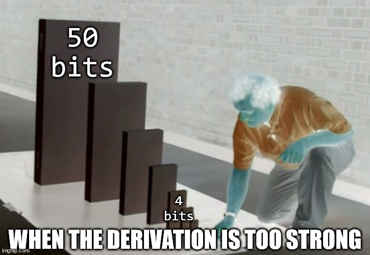

# Tight Schedule

Category | Author | Solves | Points
-------- | ------ | -----: | -----:
Crypto   | ???    | 4      | 493

> Vous devez analyser ce chiffrement par bloc trafiqué par votre stagiaire Tuco, *el famoso* :-)

**Challenge files:**
- `tight-schedule.py`
- `output.txt`


## Approaching the challenge

The goal is fairly obvious.
Given a plaintext/ciphertext pair, we have to retrieve the key used to initialize a [substitution-permutation network](https://en.wikipedia.org/wiki/Substitution%E2%80%93permutation_network).
The first reflex is to google the first few bytes of the sbox to see whether we're dealing with anything custom (read: suspicious) or widely known (read: nothing-up-my-sleeve); turns out it's AES's.
As such, we'll work under the assumption that the sbox is basically unbreakable — the name of the chall being Tight Schedule, it's expected the vulnerability will lie in the [key schedule](https://en.wikipedia.org/wiki/Key_schedule) anyways.

Let's look at the `expandKey` function.
```py
    def expandKey(self, k):
        rk = [k]
        for _ in range(10):
            rk.append(self._round(rk[-1], self.RCON[len(rk)]))
        return rk
```
It takes in the cipher key, and derives a bunch of round keys.
Nothing special.
We'll have to dig a tiny little bit deeper and analyze the `_round` function.
```py
    def _round(self, x, cst = 0):
        a, b, c, d = x[-4:]
        t = bytes([self.S[b] ^ cst, self.S[c], self.S[d], self.S[a]])
        y  = xor(x[ 0: 4], t)
        y += xor(x[ 4: 8], y[-4:])
        y += xor(x[ 8:12], y[-4:])
        y += xor(x[12:16], y[-4:])
        return y
```
For the purpose of this function I'll write `x = [x0, x1, x2, x3]`.
Basically, it defines an "offset" `t = S[x3]`, then computes a new state with the following equations:
```s
y ^ [t] = [ x0, x0 ^ x1, x0 ^ x1 ^ x2, x0 ^ x1 ^ x2 ^ x3 ]
```
Ok. So what?
Nothing too obvious and it's already past midnight so let's head to sleep and think about it with a clear head tomorrow.


Nevermind.
It's actually glaringly obvious (and somehow I did manage to sleep after that realisation): if we consider `t` as an external, completely independent variable, there is no diffusion.
In other words, knowing the `i`th bit of `x0`,`x1`,`x2`,`x3` and `t` immediately yields the `i`th bit of `y0`,`y1`,`y2` and `y3`.
This sounds absolutely disastrous, so let's keep looking in that direction!

The main intuition we'll follow for now is that by working bit-per-bit (or byte-per-byte) will reduce the search space enough that we can simply bruteforce the key.
It'll probably be something around `2^32` iterations for each chunk, or a variation of that.
Ideally we'll be able to maintain some kind of invariant throughout the encryption/decryption which will tell us whether our guess is correct.

Of course, the above is just vague intuition.
Just talking won't give us the invariants, we can't have anything from nothing.
By playing around with the defining equation for `y`, we see that it is possible to erase `t` to get some linear equations in `x` for `z = round(y)`.
This is of course highly suspicious and sounds like a pain to work through (given that there are 50 rounds to expand).
It is high time for my beloved, symbolic analysis <3

We'll model the cipher in a very simple way:
- 4 variables for the key (`x0`, `x1`, `x2`, `x3`), which will represent the `i`-th bit of the actual `x0` ... `x3`.
- 10 variables for the `t` that appear in the key expansion (`t0` ... `t9`).
- 50 variables for the `t` that appear in the encryption (`s0` ... `s49`).
- 4 variables for the plaintext (`p0` ... `p3`).
Given these symbols the cipher becomes fully linear and is easy to reimplement (cf. [`solve.sage`](./solve.sage)).
Running the symbolic encryption gives equations for bytes of the ciphertext.

```py
R = GF(2)[vars('p',4, 'x',4, 't',10, 's',50)]
ps = R.gens()[:4]
xs = R.gens()[-64:-60]
ts = R.gens()[-60:-50]
ss = R.gens()[-50:]

rk = symexpand(xs)
symc = symenc(ps, rk)
for ci in symc:
    print('-'*50)
    print(ci)
```
```s
--------------------------------------------------
p00 + x00 + t01 + t03 + t05 + t07 + t09 + s00 + s01 + s02 + s03 + s04 + s05 + s06 + s07 + s08 + s09 + s10 + s11 + s12 + s13 + s14 + s15 + s16 + s17 + s18 + s19 + s20 + s21 + s22 + s23 + s24 + s25 + s26 + s27 + s28 + s29 + s30 + s31 + s32 + s33 + s34 + s35 + s36 + s37 + s38 + s39 + s40 + s41 + s42 + s43 + s44 + s45 + s46 + s47 + s48 + s49
--------------------------------------------------
p01 + x01 + t01 + t03 + t05 + t07 + t09 + s01 + s03 + s05 + s07 + s09 + s11 + s13 + s15 + s17 + s19 + s21 + s23 + s25 + s27 + s29 + s31 + s33 + s35 + s37 + s39 + s41 + s43 + s45 + s47 + s49
--------------------------------------------------
p00 + p02 + x00 + x02 + t01 + t05 + t09 + s00 + s01 + s04 + s05 + s08 + s09 + s12 + s13 + s16 + s17 + s20 + s21 + s24 + s25 + s28 + s29 + s32 + s33 + s36 + s37 + s40 + s41 + s44 + s45 + s48 + s49
--------------------------------------------------
p01 + p03 + x01 + x03 + t01 + t05 + t09 + s01 + s05 + s09 + s13 + s17 + s21 + s25 + s29 + s33 + s37 + s41 + s45 + s49
```
Very long, not very interesting.
We already know there's bound to be lots of cancellation going on; a little LLL to minimize equations won't hurt! (recall that LLL combines rows linearly, so everything it outputs is computable from the bits of `c`).


```py
print('\n'+'*'*100+'\n')

M = matrix(ZZ, [
    [ci.monomial_coefficient(gi) for gi in R.gens()]
    for ci in symc
]).LLL().change_ring(GF(2))
print(M)

g = vector(R, R.gens())
V = GF(2)^R.ngens()

for v in M:
    w = sum(map(int, v))
    if w < 25:
        print(w, '|', g * V(v))

print('\n'+'*'*100+'\n')
```
```s
****************************************************************************************************

[0 0 0 1 0 0 0 1 0 0 0 1 0 0 0 1 0 0 0 0 0 1 0 0 0 1 0 0 0 1 0 0 0 1 0 0 0 1 0 0 0 1 0 0 0 1 0 0 0 1 0 0 0 1 0 0 0 1 0 0 0 1 0 0 0 1 0 0]
[0 0 1 1 0 0 1 1 0 0 0 0 0 0 0 0 0 0 0 0 1 0 0 0 1 0 0 0 1 0 0 0 1 0 0 0 1 0 0 0 1 0 0 0 1 0 0 0 1 0 0 0 1 0 0 0 1 0 0 0 1 0 0 0 1 0 0 0]
[0 1 0 1 0 1 0 1 0 1 0 0 0 1 0 0 0 1 0 1 0 0 0 1 0 0 0 1 0 0 0 1 0 0 0 1 0 0 0 1 0 0 0 1 0 0 0 1 0 0 0 1 0 0 0 1 0 0 0 1 0 0 0 1 0 0 0 1]
[1 1 1 1 1 1 1 1 0 0 0 0 0 0 0 0 0 0 1 0 0 0 1 0 0 0 1 0 0 0 1 0 0 0 1 0 0 0 1 0 0 0 1 0 0 0 1 0 0 0 1 0 0 0 1 0 0 0 1 0 0 0 1 0 0 0 1 0]
16 | p03 + x03 + t03 + t07 + s03 + s07 + s11 + s15 + s19 + s23 + s27 + s31 + s35 + s39 + s43 + s47
16 | p02 + p03 + x02 + x03 + s02 + s06 + s10 + s14 + s18 + s22 + s26 + s30 + s34 + s38 + s42 + s46
20 | p01 + p03 + x01 + x03 + t01 + t05 + t09 + s01 + s05 + s09 + s13 + s17 + s21 + s25 + s29 + s33 + s37 + s41 + s45 + s49
21 | p00 + p01 + p02 + p03 + x00 + x01 + x02 + x03 + s00 + s04 + s08 + s12 + s16 + s20 + s24 + s28 + s32 + s36 + s40 + s44 + s48

****************************************************************************************************
```
This is already a lot more interesting.
See how every equation only depends on every fourth variable?
This is suspicious as hell, a definite sign we're going in the right direction.
It's still not obvious at all how to exploit the pattern, however, so let's dig deeper.

## Derivation tables

Here, we shall note `y = round(x)`; `z = round(y)`; `u = round(z)`; `v = round(u)`.
The `t` in ```
y ^ [t] = [ x0, x0 ^ x1, x0 ^ x1 ^ x2, x0 ^ x1 ^ x2 ^ x3 ]
``` shall be renamed `t[y]`, so that we recall to which level it is tied.

Trying to keep the `t` from appearing for as long as possible (given the above patterns, it's going to be 4 levels), we obtain the following equation:
```s
v3 ^ t[v] ← u0 ^ u1 ^ u2 ^ u3
          ← z1 ^ z3
          ← y2 ^ y3
          ← x3
```
(tl;dr `t` will appear as soon as you xor an odd amount of variables).
Knowing a bit gives you a relation FIVE levels down??
Very interesting, very suspicious.

We can in fact derive similar equations for the other bits, eg.
```s
y0 ^ y[t] ← x0      and      z1 ^ z[t] ← y0 ^ y1
                                       ← x1
```
Less interesting, still as suspicious.


However, it is clear that handling these equations by hand is going to be absolutely awful.
We need something much more compact and visual.
Something in which we can easily display what is known and deduced. 
This is the point where I introduce a new notation, dubbed *derivation table*.

It is something very simple:
```s
__| 0  1  2  3  t
x |          .        
y |       ^  ^  b
z |    ^     ^
u | ^  ^  ^  ^
v |          *  .

 .: given
 ^: deduced up to xor
 *: deduced
 b: deduced if full byte (warning: not in the same table)
```
Being given `x3` and `t[v]`, we know respectively `y2 ^ y3`, `z1 ^ z3`, `u0 ^ u1 ^ u2 ^ u3` and `v3`.
Here are the derivation tables for `x0`, `x1` and `x2`:
```s
__| 0 1 2 3 t     __| 0 1 2 3 t     __| 0 1 2 3 t
x | .             x |   .           x |     .        
y | ^       ^     y | ^ ^           y |   ^ ^    
                  z |   ^     ^     z | ^   ^    
                                    u | ^ ^ ^   ^
                                    v |     ^   ^
```
The point is that we can play around and combine them, for different patterns of given (read: bruteforced) information.
For instance, assuming we bruteforce the bit (3) at every level, we see that after some time we get every bit at every level in the derivation table.
If we bruteforce the full byte we get more information in another table
```s
__| 0  1  2  3  t           __| 0  1  2  3  t
x |          .              … |       .  .
y |       *  .  b    (b)    … |    ^  ^  ^   
z |    *  *  .  b   ~~~~~>  x | ^  ^  ^  ^   
u | *  *  *  .  b           y | ^  ^  ^  *  @
v | *  *  *  .  b           z |       *  *  @

 @: external information
```

After playing around a bit, one may arrive at the following by repeatingly applying the table for bit (2) back and forth:
```s
__| 0 1 2 3 t           __| 0 1 2 3 t           __| 0 1 2 3 t           __| 0 1 2 3 t
… |                     … |                     … |                     … |     *    
x |                     x |     *               x |     *               x |     *    
y |     .        ==>    y |     .        ==>    y |   * .        ==>    y |   * .        ==>    ...
z |   * .               z |   * .               z | * * .               z | * * .    
u | * * .               u | * * .               u | * * .   *           u | * * .   *
v | * * .   *           v | * * .   *           v | * * .   *           v | * * .   *
```
HYPE?

Bruteforcing only four bits worth of information gives you the entire table?!
Even though `t` is supposed to depend on external information??
This is *very* suspicious, but not for the same reasons as before.



Even so, it is difficult to see where this has gone wrong.
After having rechecked this derivation 50 times I go to sleep.
Implementing it in the morning is sure to tell where the equations fail, after all.

Zzz.

Woops. Turns out the table for bit (2) was wrong.
The underlying derivation
```s
v2 ^ t[v] ^ t[u] ← u0 ^ u1 ^ u2 ^ t[u]
                 ← z0 ^ z2
                 ← y1 ^ y2
                 ← x2
```
shows in fact that `x2` does not give `v2 ^ t[v]` but `v2 ^ t[v] ^ t[u]`.
The corrected table looks like this:
```s
__| 0  1  2  3  t
x |       .      
y |    ^  ^
z | ^     ^
u | ^  ^  ^     ^
v |       ^     ↑

 ↑: deduced up to xor (with dependence on upward bit)
```
Hence the previous magical derivation fails when we try to go up a level.


## The solve

After playing around a while more, it becomes clear that derivation tables are not going to work: even if we were to know `x0,x1,x2,x3` and everything before that, it is impossible to actually deduce anything five levels down :c

It is also very frustrating that `x3` actually gives *more* information, but we can't use it because it ends up elsewhere.
However, not all is lost!


Following the conventions of `_round`, we call `a = x3[0]` ... `d = x3[3]`.
Then, if we are very determined to use the external information, we might start with something like this:
```s
         a           b           c           d     
   | 0 1 2 3 t | 0 1 2 3 t | 0 1 2 3 t | 0 1 2 3 t |
────────────────────────────────────────────────────
 x |       .   |           |           |           |
 y |         b |           |           |       . @ |
 z |           |           |       . @ |         b |
 u |           |       . @ |         b |           |
 v |         @ |         b |           |           |
```

And then... a miracle happens!
```s
         a           b           c           d     
 r | 0 1 2 3 t | 0 1 2 3 t | 0 1 2 3 t | 0 1 2 3 t |
────────────────────────────────────────────────────
 0 |       .   |     ^ ^   |   ^   ^   | ^ ^ ^ ^   |
 1 |     ^ ^ b |   ^   ^   | ^ ^ ^ ^   |       . @ |
 2 |   ^   ^   | ^ ^ ^ ^   |       . @ |     ^ ^ b |
 3 | ^ ^ ^ ^   |       . @ |     ^ ^ b |   ^   ^   |
 4 |       * @ |     ^ ^ b |   ^   ^   | ^ ^ ^ ^   |
 5 |     ^ ^ b |   ^   ^   | ^ ^ ^ ^   |       * @ |
 6 |   ^   ^   | ^ ^ ^ ^   |       * @ |     ^ ^ b |
 7 | ^ ^ ^ ^   |       * @ |     ^ ^ b |   ^   ^   |
 8 |       * @ |     ^ ^ b |   ^   ^   | ^ ^ ^ ^   |
 9 |     ^ ^ b |   ^   ^   | ^ ^ ^ ^   |       * @ |
10 |   ^   ^   | ^ ^ ^ ^   |       * @ |     ^ ^ b |
```
At the mere price of 4 bytes, we get a self propagating pattern! (this may very well be the long sought after invariants :o)

But the good news do not stop there...
Note that we don't need to bruteforce things across 4 different rows.
After all, given `x3a`, knowing `x0d ^ x1d ^ x2d ^ x3d` or `y3d` is pretty much the same.
This means that the information we brute can all lie at a single level, assuming a given shape.
There are four different shapes, tied to the *phase* — the offset from the first row, modulo 4.

But the good news do not stop there...
Another miracle happens!
```s
         a           b           c           d     
 r p | 0 1 2 3 t | 0 1 2 3 t | 0 1 2 3 t | 0 1 2 3 t |
──────────────────────────────────────────────────────
 0 0 |       .   |     ^ ^   |   ^   ^   | ^ ^ ^ ^   | ← k0 ; c
 1 1 |     ^ ^ b |   ^   ^   | ^ ^ ^ ^   |       . @ | ← k1
 2 2 |   ^   ^   | ^ ^ ^ ^   |       . @ |     ^ ^ b | ← k2
 3 3 | ^ ^ ^ ^   |       . @ |     ^ ^ b |   ^   ^   |
 4 0 |       * @ |     ^ ^ b |   ^   ^   | ^ ^ ^ ^   |
 5 1 |     ^ ^ b |   ^   ^   | ^ ^ ^ ^   |       * @ | ← round5(c+k0)
 6 2 |   ^   ^   | ^ ^ ^ ^   |       * @ |     ^ ^ b |
 7 3 | ^ ^ ^ ^   |       * @ |       ^ b |   ^   ^   |
 8 0 |       * @ |     ^ ^ b |     ^ ^   | ^ ^ ^ ^   |
 9 1 |     ^ ^ b |   ^   ^   |   ^   ^   |       * @ |
10 2 |   ^   ^   | ^ ^ ^ ^   | ^ ^ ^ * @ |     ^ ^ b | ← round5(c+k1)
```
Whenever we need to xor the current ciphertext `c` with a round key, it turns out they are both in the same phase (because `5 = 1 mod 4`).
Funny coincidence, isn't it?
Almost as if the challenge was designed for that.

With all of this, the solve becomes fairly straightforward:
- For every phase:
  - brute the phased key (`2^32` iterations);
  - encrypt the phased plaintext;
  - compare with the phased ciphertext.
The python script is fairly simple (cf [`solve.py`](./solve.py)).
However, our friend `tqdm` predicts ONE HUNDRED EIGHTY SIX hours for a single bruteforce.

Time to reimplement everything in `c` (cf [`solve.c`](./solve.c)) and let it run during dinner.
A plate of spaghettis later, we have the phased keys.
```s
Bruting phased key (phase 0)
a = 0 | a = 1 | a = 2 | a = 3 | a = 4 | a = 5 | a = 6 | a = 7 | a = 8 | a = 9 | a = 10 | a = 11 | a = 12 | a = 13 | a = 14 | a = 15 | a = 16 | a = 17 | a = 18 | a = 19 | a = 20 | a = 21 | a = 22 | a = 23 | a = 24 | a = 25 | a = 26 | a = 27 | a = 28 | a = 29 | a = 30 | a = 31 | a = 32 | a = 33 | a = 34 | a = 35 | a = 36 | a = 37 | a = 38 | a = 39 | a = 40 | a = 41 | a = 42 | a = 43 | a = 44 | a = 45 | a = 46 | a = 47 | a = 48 | a = 49 | a = 50 | a = 51 | a = 52 | a = 53 | a = 54 | a = 55 | a = 56 | a = 57 | a = 58 | a = 59 | a = 60 | a = 61 | a = 62 | a = 63 | a = 64 | a = 65 | a = 66 | a = 67 | a = 68 | a = 69 | a = 70 | a = 71 | a = 72 | a = 73 | a = 74 | a = 75 | a = 76 | DING DING DING!!!
partk = [76, 127, 191, 108]
Bruting phased key (phase 1)
a = 0 | a = 1 | a = 2 | a = 3 | a = 4 | a = 5 | a = 6 | a = 7 | a = 8 | a = 9 | a = 10 | a = 11 | a = 12 | a = 13 | a = 14 | a = 15 | a = 16 | a = 17 | a = 18 | a = 19 | a = 20 | a = 21 | a = 22 | a = 23 | a = 24 | a = 25 | a = 26 | a = 27 | a = 28 | a = 29 | a = 30 | a = 31 | a = 32 | a = 33 | a = 34 | a = 35 | a = 36 | a = 37 | a = 38 | a = 39 | a = 40 | a = 41 | a = 42 | a = 43 | a = 44 | a = 45 | a = 46 | a = 47 | a = 48 | a = 49 | a = 50 | a = 51 | a = 52 | a = 53 | a = 54 | a = 55 | a = 56 | a = 57 | a = 58 | a = 59 | a = 60 | a = 61 | a = 62 | a = 63 | a = 64 | a = 65 | a = 66 | a = 67 | a = 68 | a = 69 | a = 70 | a = 71 | DING DING DING!!!
partk = [71, 142, 75, 90]
Bruting phased key (phase 2)
a = 0 | a = 1 | a = 2 | a = 3 | a = 4 | a = 5 | a = 6 | a = 7 | a = 8 | a = 9 | a = 10 | a = 11 | a = 12 | a = 13 | a = 14 | a = 15 | a = 16 | a = 17 | a = 18 | a = 19 | a = 20 | a = 21 | a = 22 | a = 23 | a = 24 | a = 25 | a = 26 | a = 27 | a = 28 | a = 29 | a = 30 | a = 31 | a = 32 | a = 33 | a = 34 | a = 35 | a = 36 | a = 37 | a = 38 | a = 39 | a = 40 | a = 41 | a = 42 | a = 43 | a = 44 | a = 45 | a = 46 | a = 47 | a = 48 | a = 49 | a = 50 | a = 51 | a = 52 | a = 53 | a = 54 | a = 55 | a = 56 | a = 57 | a = 58 | a = 59 | a = 60 | a = 61 | a = 62 | a = 63 | a = 64 | a = 65 | a = 66 | a = 67 | a = 68 | a = 69 | a = 70 | a = 71 | a = 72 | a = 73 | a = 74 | a = 75 | a = 76 | a = 77 | a = 78 | a = 79 | a = 80 | a = 81 | a = 82 | a = 83 | a = 84 | a = 85 | a = 86 | a = 87 | a = 88 | a = 89 | a = 90 | a = 91 | a = 92 | a = 93 | a = 94 | a = 95 | a = 96 | DING DING DING!!!
partk = [96, 185, 153, 233]
Bruting phased key (phase 3)
a = 0 | a = 1 | a = 2 | a = 3 | a = 4 | a = 5 | a = 6 | a = 7 | DING DING DING!!!
partk = [7, 64, 187, 9]
Segmentation fault
```
The only thing left is to recombine the key from its phases and get the flag! (cf [`solve_final.py`](./solve_final.py))

