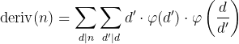
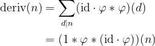
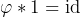
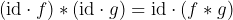
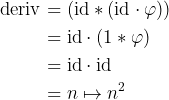

# New Technology
#### **Category:** Crypto
#### **Author:** Robin_Jadoul
#### **Points:** 300
#### **Description:**
> If it's not Windows New Technology, what else could NT stand for?
#### **Attachments:** [new_technology.py](./new_technology.py)

## Symbols:

g * f: [Dirichlet convolution](https://en.wikipedia.org/wiki/Dirichlet_convolution) of g and f (explained later on).
g • f: n -> g(n) f(n)
d | n: d is a [divisor](https://en.wikipedia.org/wiki/Divisor) of n

## Understanding the challenge

We are given a file with the following functions:

   - `gen()`: generates a random number as a product of five 512-bits primes to the power of 1 to 4 (random as well). Returns the factorisation and the number.
   - `normalize(fac)`: returns the number associated to the given factorisation.
   - `divs(fac)`: returns all the divisors of the number represented by the given factorisation.
   - `phi(fac)`: returns the [Euler's totient](https://en.wikipedia.org/wiki/Euler%27s_totient_function) of the number represented by the given factorisation.
   - `deriv(fac)`: derives a number from the given factorisation, using the following formula.



   - `priv, pub = gen()`: `priv` is the factorisation, `pub` the number.
   - `key = deriv(priv)`
   - `ciphertext = ENC_key(flag)`: `ENC_k` is [AES](https://en.wikipedia.org/wiki/Advanced_Encryption_Standard)-[CBC](https://en.wikipedia.org/wiki/Block_cipher_mode_of_operation#Cipher_block_chaining_(CBC)) encryption, with `0` as iv and `SHA256(str(k))` as key.

**Goal:** Find the output of `deriv(n)` without knowing the factorisation of `n`.

## Solving the challenge

What is a dirichlet convolution? It is a sum over divisors (see below) that has really nice properties!


For instance `f * g = g * f`, or `f * (g * h) = (f * g) * h`, and even `f * (g + h) = (f * g) + (f * h)`! The question you might ask yourself right now is "Why are these things even relevant to the challenge?"

Well, it turns out that `deriv` is not any other function; it's a dirichlet convolution!



Now there is a number of neat identities we can use to finish this:

- 

- 

Applying them one after the other, we finally get:



## Solve script

Time to implement that!

```py
from Crypto.Cipher import AES
from hashlib import sha256

pub = ...
ciphertext = ...

key = pub*pub
aes = AES.new(sha256(str(key).encode()).digest(), AES.MODE_CBC, iv=b'\0' * 16)
print(aes.decrypt(ciphertext))
```


### Side Note

You could also just play around with deriv and notice that it simply squared numbers together. But that's not as fun as proving why it works, right?